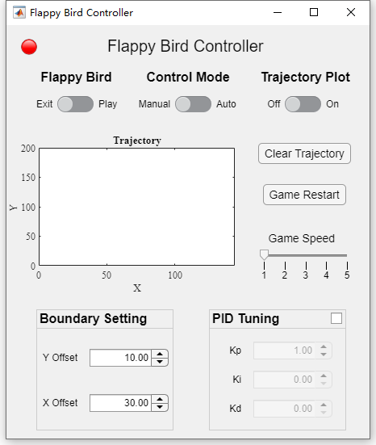

# Flappy Bird Controller

The aim of this project is to develop an interactive controller app through MATLAB app designer to play the game autonomously. The control algorithm is implemented by bang-bang control and PID control. Besides, all controller’s parameters can be tuned in app’s interface and the trajectory of bird and tubes can be drawn in real time.

## Features
- A flappy bird controller implemented in ***MATLAB app designer***.
- It supports ***bang-bang*** and ***PID control***
- The heighest score is ***135 for bang-bang*** and there is ***no limit for PID***.
- A vedio [demo](docs/demo.mp4) is inclued.
- For more detials, please check the report paper in [docs](docs).

## Quick Start

1. Check out this repository and download the source code

    `git clone git@github.com:silvery107/flappy-bird-pid-gui.git`

2. Open code inside ***MATLAB***, this project is implemented under version ***2020b***.
3. Directly run `flappybird_controller_exported.m` or install the app ***Flappy Bird Controller.mlappinstall***

<!--  -->

